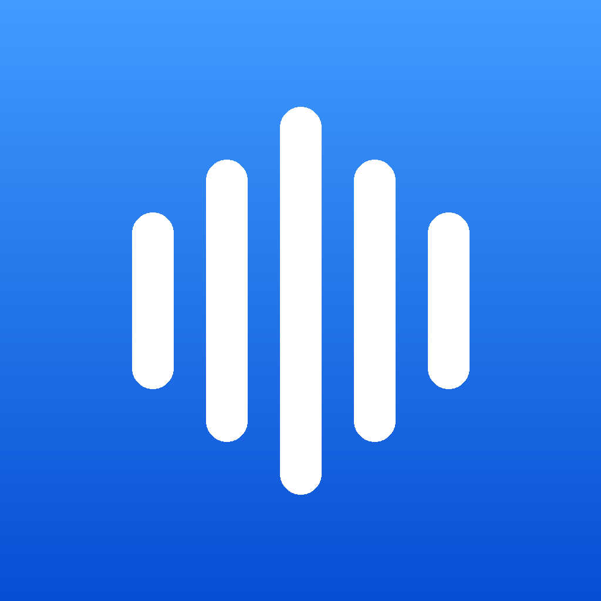
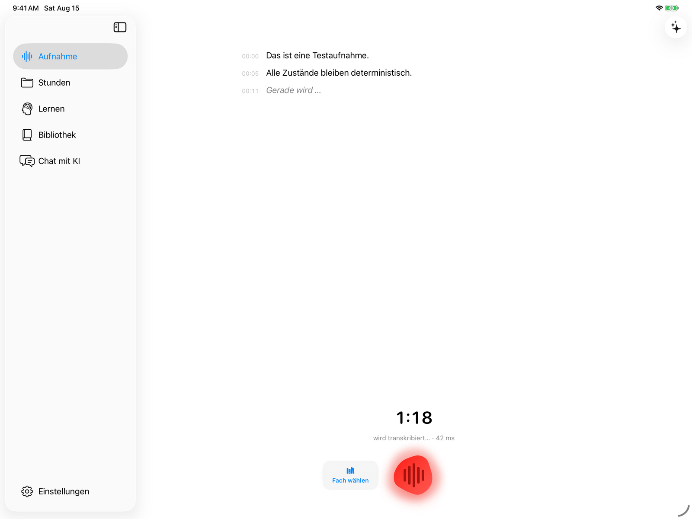
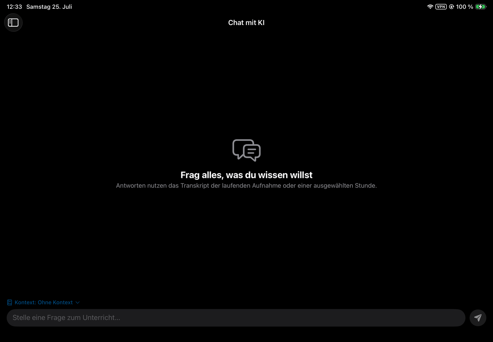
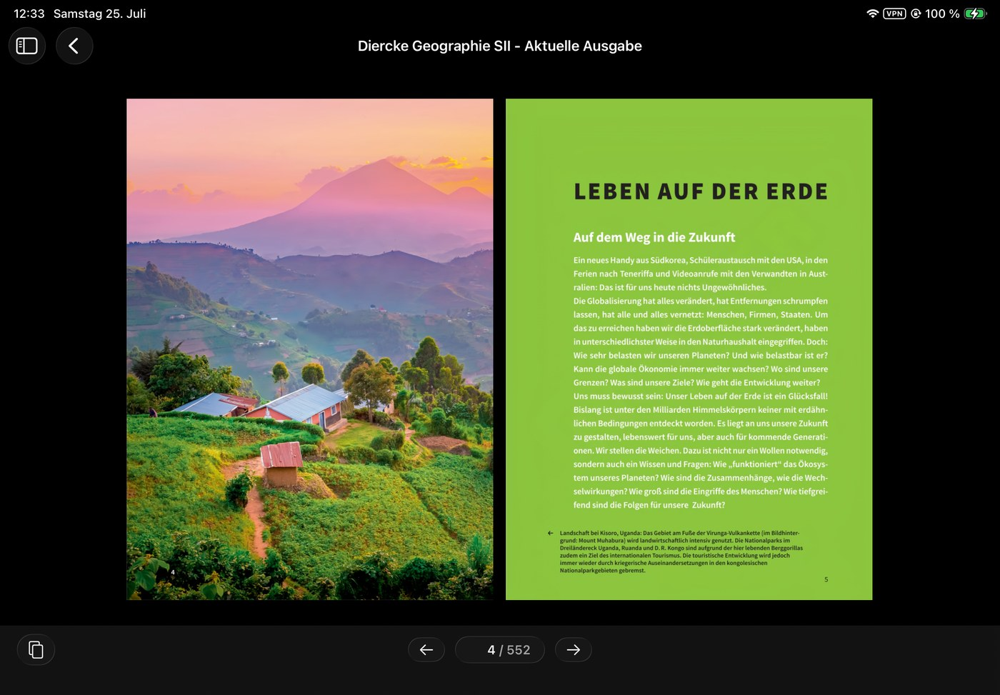
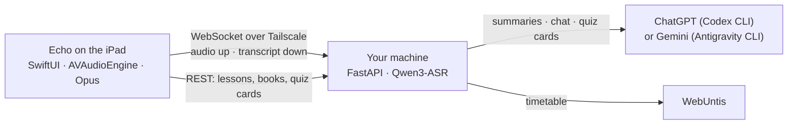

<p align="center">
  
</p>

<h1 align="center">Echo</h1>

<p align="center">
  Live lesson transcription, a searchable lesson archive, and your schoolbooks —
  on an iPad, powered by a machine you own.
</p>

<p align="center">
  <a href="#features">Features</a> ·
  <a href="#what-you-need">What you need</a> ·
  <a href="#what-it-doesnt-do">What it doesn't do</a> ·
  <a href="#setup">Setup</a> ·
  <a href="#building-without-a-mac">Building without a Mac</a>
</p>

<p align="center">
  
  
  
</p>

Echo is the iPad half of a pair. It streams the microphone to a backend running on
your own machine, which transcribes the lesson locally and keeps the transcript,
the audio, and everything derived from them. The iPad records, displays and asks;
it stores almost nothing itself.

It is not on the App Store, and it does nothing on its own. Without the backend
and a working [Tailscale](https://tailscale.com) connection to it, the app is an
empty shell. The interface is in German.

<p align="center">
  
</p>

## Features

### Live transcription

Audio is captured with AVAudioEngine, encoded as Opus, and streamed over a
WebSocket to the backend, which runs Qwen3-ASR on its own GPU. Recognised text
comes back while the teacher is still talking. Nothing is sent anywhere else
unless you press something that asks an AI a question.

The transcript fills the page as it arrives. Everything else — the sidebar, the
record control, the answer note — sits at the edges.

After class, a lesson's transcript menu can explicitly start a higher-quality
second pass from the local 48-kHz safety recording. The upload resumes after a
connection failure and never starts automatically. The live transcript stays
visible until the backend has completed the replacement; if it was manually
edited in the meantime, the new result is saved only as another restorable
version.

The same menu opens the timestamp-preserving transcript editor and a per-subject
vocabulary. Vocabulary can be maintained by hand or, on request, populated from
corrections, timetable names, earlier lessons and matching books in the Echo
library.

### It knows your timetable

Connect WebUntis and recordings name themselves: subject, teacher, room. Record
straight through a double period and the recording is cut into one lesson per
period afterwards, so the archive matches the timetable rather than the tape.

### The lesson archive

Stunden is a grid of folders, one per subject, each in its own colour with its
own icon. The folders come from WebUntis rather than from what happens to have
been recorded, so every subject you take has its place from the first launch and
an empty archive still looks like your own timetable. **Sonstige** collects
whatever was recorded while no lesson was running — the holidays, an evening, a
free period — and is the one folder the timetable cannot supply.

Open a folder and the subject's recordings are there, headed by the two figures
a subject adds up to — how long it has been recorded for in total, and how much
of that was this week. Every row leads with **what the lesson was about**: three
or four words, written by the AI as the first line of the summary, on one line
and never two. Under it the date and how long it ran, then the opening of the
summary — so the list reads for what was taught rather than for when. On a wide
window the list is cut in half and set in two columns, still read top to bottom,
newest first. A long press on a row deletes the lesson.

A lesson is three cards: what it was about, the recording, and what was said.
The summary writes itself when the recording ends — the archive is a dozen
lessons of one subject at nearly the same time of day, and being told what each
one covered should not cost a button press per lesson. Transcript and audio both
stay on the server. The recording plays from its own waveform, so the silence
before the lesson started is visible rather than something you drag to find, and
tapping any line of the transcript plays from that moment while the page follows
along.

Each archived lesson can also import notes authored elsewhere: native
Goodnotes documents, Notability `.note` files with an embedded PDF, PDFs,
JPEGs and PNGs. PDF export is the dependable interchange route for Notability.
Echo decodes searchable text, exact typed objects and Goodnotes' own
handwriting index locally on the iPad. For scans and missing handwriting data,
Apple Vision's accurate on-device text model is used as a conservative
fallback. Visual page coordinates determine reading order. When Goodnotes
includes a page-content timestamp inside the lesson, the imported page links
to that point in the recording. It is labelled as the page's last edit, not
presented as an exact timestamp for every Pencil stroke. Reimporting the same
Goodnotes page updates it through the document's stable internal IDs.

The original Goodnotes/Notability/PDF/image file and all rendered page images
remain on the iPad. Echo sends only the locally extracted text, stable page ID,
optional page timestamp and warnings to the user's own backend; new imports do
not create server-side note attachments.

Echo has no note editor or drawing canvas. Goodnotes and Notability remain the
place where notes are written; Echo only imports, reads and links them.

Echo also installs an iOS Share Extension. A page or document shared from
Goodnotes, Notability or Files is placed in Echo's App Group inbox. Open the
destination lesson, choose **Unterrichtsnotizen**, then tap the queued document
under **Aus dem Teilen-Menü**. The extension never guesses which lesson a file
belongs to and does not upload anything before that explicit choice.

### Lernen

Each lesson becomes a quiz deck, scheduled on a Leitner ladder. A card you get
wrong returns tomorrow; a card you get right returns after 1, 3, 7, 14 and 30
days. Only exam-relevant material becomes cards.

The tab is one screen and one button. It opens on today: the date, the number
of cards due, roughly how long that takes, a bar showing which subjects the
round is made of, and **Lernen starten**. Under it the same subjects as rows —
each with its own colour and glyph, the ones the Stunden folders use — then the
exams that are coming with the days left beside them, and at most three topics
that are still wobbling. The daily budget sits next to the plan's heading, not
in front of the work; it is one setting, shared with Einstellungen → Lernen.

A round is a full-screen mode with one way out. Its header carries the subject
and the lesson the current card came from; the question is the largest thing on
the screen and stands on the background rather than in a box. One question at a
time, two interactions for a multiple-choice card and three for a written one,
pass/fail self-assessment with the finer grades one level down. After each
answer the card says what it did — *kommt morgen wieder* or *kommt später
wieder*. Progress survives locking the iPad, switching apps and being killed for
memory: the round is written to disk after every answer and picked up again
within half an hour.

Every card knows which minute of which lesson it was written from, so an answer
offers two ways back into the lesson: **Im Unterricht hören** plays the passage
itself, with three seconds of run-up, stopping where the question stopped, and
**Nachfragen** asks the AI about this card with that lesson's transcript already
as its context. The follow-up is thrown away with the round; the Chat tab keeps
its own conversation.

The result is a count, one bar of right against open, what follows from it, and
the cards that were missed — each opening to its answer and explanation without
asking for another attempt.

Cards, plan and exams are stored on the iPad. The Lernen screen renders from
that store before any request is made, a round can be played through with no
network at all, and answers wait in a queue until the server is back. Browsing
lives in Stunden, where the lessons already are: a subject board says how many
of its cards are waiting and starts them, a lesson row shows what is due in it,
and a lesson page can have its cards written.

### Chat and the answer note

The chat answers free-form questions about the running recording or any past
lesson. While recording, a sticky note on the page answers "what did they just
say" for the last N seconds. A Home and Lock Screen widget does the same and is
deliberately anonymous-looking, which matters more than it should.

<p align="center">
  
</p>

The context picker under the conversation decides what a question is answered
from: nothing, the running recording, or one particular lesson.

### Bibliothek

The schoolbook shelf. PDFs sit in one folder on the server, appear in the app as
a grid of covers, and a book downloads once, into permanent storage, the first
time it is opened. After that it is available offline.

The reader shows a book rather than a document. One page, or a real 2–3 spread,
fills the screen; nothing scrolls; pages turn with a sideways flick. Zooming out
stops when the page reaches its natural size on the display, worked out for each
book from its own page dimensions and the current layout, so no book can shrink
into a stamp in the middle of the screen.

Schoolbooks rarely print page 1 on the first PDF page, so every book learns its
own numbering once: turn to any page whose number you can read, type that number,
and the rest of the book follows. It is remembered per book.

<p align="center">
  
</p>

### Dead zones don't cost you the lesson

If the network drops mid-lesson, recording continues and the backlog — up to
roughly 100 minutes of audio — is replayed when the connection returns. Nothing
said during an outage is lost.

## What you need

- A Linux or Windows machine with an NVIDIA or AMD GPU, running the companion
  backend. Transcription happens there, so this is the piece that decides how
  fast text appears.
- A [Tailscale](https://tailscale.com) account, with both the iPad and that
  machine in the same tailnet.
- An iPad on iPadOS 26 or later, and a way to sideload an IPA (SideStore,
  AltStore, or your own developer account).
- Optionally a WebUntis account for the timetable features. The credentials live
  on your server, never on the iPad.

## What it doesn't do

- **It is not usable without a server.** There is no cloud, no account, and no
  hosted mode. If the machine at home is off, the app has nothing to talk to.
- **It is not multi-user.** One person, one tailnet, one set of lessons. Nothing
  in the design anticipates a second user.
- **It is not localised.** The interface is German throughout.
- **It is not distributed.** No App Store, no TestFlight, no signed builds. You
  build the IPA yourself and sideload it, and re-signing is on you.
- **It does not transcribe well without a decent GPU.** The model is small but it
  is still a model, and on CPU the text arrives too late to be worth reading.

## Setup

1. **Backend.** Run the companion backend on the GPU machine and note its auth
   token and Tailscale address. Its README covers the Tailscale side end to end.
   Point `[library] dir` at the folder holding your schoolbook PDFs if you want
   the Bibliothek tab to have anything in it.
2. **iPad.** Install the [Tailscale app](https://apps.apple.com/app/tailscale/id1470499037),
   sign in with the same account as the server, and keep it connected while using
   Echo. Then build the IPA and install it.
3. **Connect.** The app opens its settings on first launch: server address, port
   (`8787` by default) and auth token, all documented in
   [`Config.example.plist`](Config.example.plist).

## Building without a Mac

This app is developed entirely from Linux, which is the most unusual thing about
the repository and the reason it is laid out the way it is.

There is no `.xcodeproj` checked in. [`project.yml`](project.yml) is the real
project file, and [XcodeGen](https://github.com/yonaskolb/XcodeGen) generates the
Xcode project on a GitHub-hosted macOS runner, which then builds, tests and
uploads an IPA artifact. Nothing about editing the app requires a Mac; only
compiling it does, and that is rented by the minute.

```bash
$EDITOR Sources/MossLive/...   # edit Swift in any editor
git push                       # a macOS runner builds and tests
gh run watch                   # collect the IPA artifact
```

Style is gated on every push by SwiftLint and SwiftFormat, on Ubuntu runners
because macOS minutes bill at ten times the rate. Both run locally through
Docker, which is worth doing before pushing:

```bash
docker run --rm -v "$PWD:/repo" -w /repo ghcr.io/realm/swiftlint:0.57.1 swiftlint
```

If you do have a Mac, `brew install xcodegen && xcodegen generate && open
MossLive.xcodeproj` behaves exactly as you would expect.

[`scripts/ci/codemagic.sh`](scripts/ci/codemagic.sh) drives a macOS build on
Codemagic instead, for when GitHub Actions is unavailable.

## Repository layout

```
project.yml                  XcodeGen project definition (the real project file)
Sources/MossLive/
  Audio/                     AVAudioEngine capture, Opus streaming encoder
  Network/                   wire protocol, WebSocket client with resume + backlog
  Model/                     app state machine, settings, stores
  Views/                     SwiftUI: transcript, lessons, learn, chat, library
Sources/MossLiveWidget/      Home and Lock Screen answer widget
LocalPackages/OpusShim/      C shim over libopus (SPM)
Tests/MossLiveTests/         unit tests
.github/workflows/           lint (ubuntu) · ci (macOS) · release
```

## Architecture



## Credits

Audio goes through [libopus](https://opus-codec.org) and
[swift-opus](https://github.com/alta/swift-opus), BSD-3-Clause.

## License

See [LICENSE](LICENSE).
