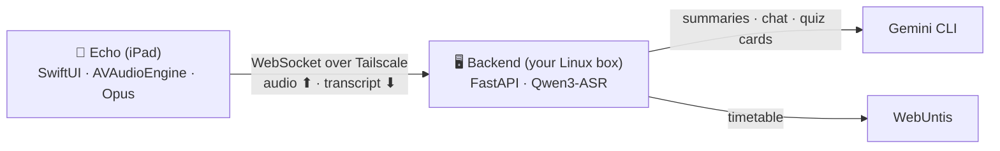

<div align="center">


# Echo

**Your lessons, written down, summarized, and turned into study material — automatically.**

An iPad app that live-transcribes class through the microphone, files every lesson
under the right subject, and helps you actually learn from it: summaries, an AI chat
grounded in what was said, and spaced-repetition quizzes.

[](https://github.com/4MBs/echo-ios/actions/workflows/ci.yml)
[](https://github.com/4MBs/echo-ios/actions/workflows/lint.yml)


</div>

---

## What it does

| | |
|---|---|
| 🎙️ **Live transcription** | Streams mic audio as Opus over a private [Tailscale](https://tailscale.com) network to your own server, which transcribes locally (Qwen3-ASR). The transcript appears live on a lined-paper notebook UI. Nothing leaves your machines except AI requests you trigger. |
| 📅 **Timetable-aware** | Connects to WebUntis: recordings are auto-named by subject, teacher and room, and a recording spanning several periods is split into one lesson each. |
| 📚 **Lesson archive** | Every lesson is stored on the server with transcript and audio. Tap any transcript line to replay exactly what was said at that moment. |
| ✍️ **Summaries** | One tap per lesson generates a focused summary of what was taught (cached after the first request). |
| 🧠 **Spaced repetition** | The Lernen tab turns each lesson into a quiz deck (exam-relevant content only) and schedules reviews on a Leitner ladder: wrong cards come back tomorrow, right ones in 1 → 3 → 7 → 14 → 30 days. |
| 💬 **Chat with AI** | Ask free-form questions grounded in the running recording or any past lesson. |
| 📝 **Answer sticky note** | While recording, a sticky note on the page answers the last N seconds on demand — and a deliberately anonymous Home/Lock-Screen widget does the same. |
| 📶 **Dead-zone safe** | If the network drops mid-lesson, recording continues and the audio backlog (up to ~100 min) is replayed on reconnect. Nothing said during an outage is lost. |

The whole UI is an old-paper notebook: scanned paper textures, ruled pages with a
red margin, handwritten headings, sticky notes and hand-drawn margin doodles.

## Architecture



The app is a thin client: transcripts, audio, summaries and quiz decks all live on
the backend (a companion FastAPI + Qwen3-ASR project). The iPad only records,
displays, and asks.

## Setup

1. **Backend**: run the companion backend on a Linux machine with a GPU and note
   its auth token and Tailscale address. Both devices must be in the same
   tailnet.
2. **App**: build the IPA (see below) and install it on the iPad.
3. **Connect**: on first launch the app opens its settings — enter the server's
   Tailscale address, port (default `8787`) and auth token
   ([`Config.example.plist`](Config.example.plist) documents the values).
   Optionally connect WebUntis under *Stundenplan*; credentials are stored on
   your server, never on the iPad.

## Building — no Mac required

This project is developed entirely from Linux. There is no checked-in Xcode
project: [`project.yml`](project.yml) is the source of truth and
[XcodeGen](https://github.com/yonaskolb/XcodeGen) generates the project on a
GitHub-hosted macOS runner, which builds, tests, and uploads an IPA artifact.

```bash
# the whole development loop
$EDITOR Sources/MossLive/...   # edit Swift in any editor
git push                       # CI builds & tests on macOS runners
gh run watch                   # wait for the IPA artifact
```

- Lint/format gate on every push (Ubuntu runners):
  SwiftLint + SwiftFormat, both runnable locally via Docker:
  ```bash
  docker run --rm -v "$PWD:/repo" -w /repo ghcr.io/realm/swiftlint:0.57.1 swiftlint
  ```
- On a Mac (optional): `brew install xcodegen && xcodegen generate && open MossLive.xcodeproj`

## Repository layout

```
project.yml                  XcodeGen project definition (the real project file)
Sources/MossLive/            app source
  Audio/                     AVAudioEngine capture → Opus streaming encoder
  Network/                   wire protocol, WebSocket client with resume + backlog
  Model/                     app state machine, settings, stores
  Views/                     SwiftUI (paper theme, transcript, learn, chat)
Sources/MossLiveWidget/      Home/Lock-Screen answer widget
LocalPackages/OpusShim/      C shim over libopus (SPM)
Tests/MossLiveTests/         unit tests
.github/workflows/           lint (ubuntu) · ci (macOS) · release
```

## Credits

- Paper textures: public-domain scans from
  [Wikimedia Commons](https://commons.wikimedia.org)
- Margin doodles: [Doodle Icons](https://khushmeen.com/icons.html) by
  Khushmeen Sidhu (CC0)
- Audio: [libopus](https://opus-codec.org) and
  [swift-opus](https://github.com/alta/swift-opus) (BSD-3-Clause)

## License

See [LICENSE](LICENSE).
