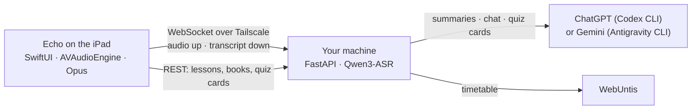

# Echo

An iPad app that listens to a school lesson, transcribes it live on a machine you
own, and files the result under the right subject. It also carries your
schoolbooks, so the same app you take notes in is the one you read from.

It is not on the App Store and it will not work on its own: it is the client half
of a pair. The other half is a FastAPI backend running on your own Linux or
Windows machine with a GPU, reachable over your own [Tailscale](https://tailscale.com)
network. The iPad records, displays and asks; everything else happens on the
server.

## What it does

**Live transcription.** The microphone is captured with AVAudioEngine, encoded as
Opus and streamed over a WebSocket to the backend, which runs Qwen3-ASR locally.
Text comes back as it is recognised and lands on the page while the teacher is
still talking. No audio goes anywhere else.

**It knows the timetable.** Connect WebUntis and recordings name themselves by
subject, teacher and room. Record straight through a double period and it is
split into one lesson per period afterwards.

**Every lesson is kept.** Transcript and audio both live on the server. Tapping a
line in a transcript plays back the audio from exactly that moment. One tap per
lesson also produces a summary of what was taught, cached after the first time.

**Lernen** turns a lesson into a quiz deck and schedules it on a Leitner ladder:
cards you get wrong come back tomorrow, cards you get right at 1, 3, 7, 14 and 30
days. **Chat mit KI** answers free-form questions about the running recording or
any past lesson. While recording, a sticky note on the page answers "what did they
just say" for the last N seconds, and a deliberately anonymous-looking
Home/Lock-Screen widget does the same without announcing what it is.

**Bibliothek** is the schoolbook shelf. PDFs sit in one folder on the server; the
app shows them as a cover grid and downloads a book on first open into permanent
storage, so it is there offline from then on. The reader shows a book, not a
scrolling document: one page or a real 2–3 spread fills the screen, nothing
scrolls, and pages turn by flicking sideways. Zooming out stops where the page
reaches its natural size on the screen, worked out per book from the page
dimensions and the layout, so no book ends up a stamp in the middle of the
display. Since schoolbooks almost never print page 1 on the first PDF page, each
book learns its own numbering once — turn to any page whose number you can read,
type that number, and the rest follows.

**Bad reception is survivable.** If the network drops mid-lesson the recording
carries on and the backlog, up to roughly 100 minutes of audio, is replayed on
reconnect. Nothing said during an outage is lost.

## How it fits together



Transcripts, audio, summaries, quiz decks and the schoolbook PDFs all live on the
backend. The only thing the iPad keeps for itself is a downloaded book and its
settings.

## Setup

1. **Backend.** Run the companion backend on a machine with an NVIDIA or AMD GPU
   and note its auth token and Tailscale address. Its README covers the Tailscale
   setup end to end. Point `[library] dir` at the folder holding your schoolbook
   PDFs if you want the Bibliothek tab to have anything in it.
2. **iPad.** Install the [Tailscale app](https://apps.apple.com/app/tailscale/id1470499037),
   sign in with the same account as the server, and keep it connected while using
   Echo. Then build the IPA (below) and install it.
3. **Connect.** The app opens its settings on first launch: server address, port
   (`8787` by default) and auth token, all documented in
   [`Config.example.plist`](Config.example.plist). WebUntis is optional and its
   credentials stay on your server.

## Building without a Mac

This is developed entirely from Linux. There is no `.xcodeproj` in the repository:
[`project.yml`](project.yml) is the real project file and
[XcodeGen](https://github.com/yonaskolb/XcodeGen) generates the Xcode project on a
GitHub-hosted macOS runner, which builds, tests, and uploads an IPA artifact.

```bash
$EDITOR Sources/MossLive/...   # edit Swift in any editor
git push                       # macOS runner builds and tests
gh run watch                   # collect the IPA
```

SwiftLint and SwiftFormat gate every push on Ubuntu runners, and both run locally
through Docker:

```bash
docker run --rm -v "$PWD:/repo" -w /repo ghcr.io/realm/swiftlint:0.57.1 swiftlint
```

On a Mac, `brew install xcodegen && xcodegen generate && open MossLive.xcodeproj`
works as you would expect.

## Repository layout

```
project.yml                  XcodeGen project definition (the real project file)
Sources/MossLive/
  Audio/                     AVAudioEngine capture, Opus streaming encoder
  Network/                   wire protocol, WebSocket client with resume + backlog
  Model/                     app state machine, settings, stores
  Views/                     SwiftUI: transcript, lessons, learn, chat, library
Sources/MossLiveWidget/      Home/Lock-Screen answer widget
LocalPackages/OpusShim/      C shim over libopus (SPM)
Tests/MossLiveTests/         unit tests
.github/workflows/           lint (ubuntu) · ci (macOS) · release
```

## Credits

Audio goes through [libopus](https://opus-codec.org) and
[swift-opus](https://github.com/alta/swift-opus), BSD-3-Clause.

## License

See [LICENSE](LICENSE).
