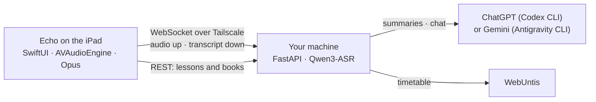

# Architecture and repository layout



## Repository layout

```
project.yml                  XcodeGen project definition (the real project file)
Sources/MossLive/
  Audio/                     AVAudioEngine capture, Opus streaming encoder
  Network/                   wire protocol, WebSocket client with resume + backlog
  Model/                     app state machine, settings, stores
  Views/                     SwiftUI: transcript, lessons, chat, library
Sources/MossLiveWidget/      Home and Lock Screen answer widget
LocalPackages/OpusShim/      C shim over libopus (SPM)
Tests/MossLiveTests/         unit tests
.github/workflows/           lint (ubuntu) · ci (macOS) · release
```
