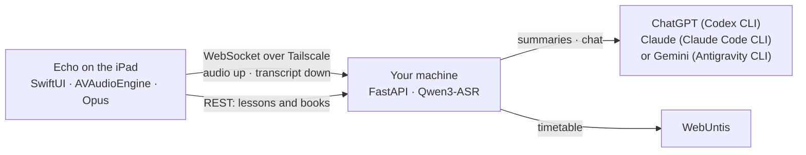

# Architecture and repository layout



## Repository layout

```
project.yml                  XcodeGen project definition (the real project file)
Sources/MossLive/
  Audio/                     AVAudioEngine capture, Opus encoder, local safety recording
  Network/                   wire protocol, WebSocket client with resume + disk backlog
  Model/                     app state machine, settings, stores
  Notes/                     Goodnotes/Notability/PDF import, parsed on the iPad
  Views/                     SwiftUI: transcript, lessons, learn, library, chat
  Testing/                   deterministic fixtures for -UITesting launches
Sources/Shared/              settings and share-inbox types used by every target
Sources/MossLiveWidget/      Home and Lock Screen answer widget
Sources/EchoShareExtension/  share sheet target that queues documents for a lesson
LocalPackages/OpusShim/      C shim over libopus (SPM)
Tests/MossLiveTests/         unit tests
Tests/MossLiveUITests/       XCUITest suite driven against the mock backend
.github/workflows/           lint (ubuntu) · ci (macOS) · ui-tests · screenshots · release
```
