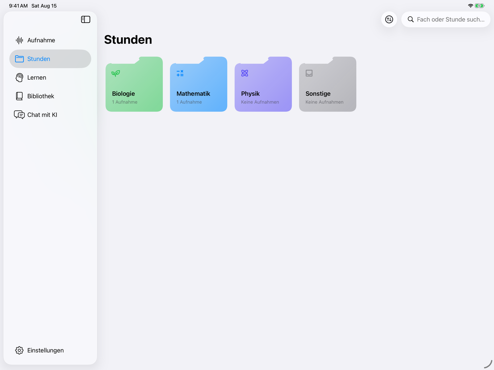
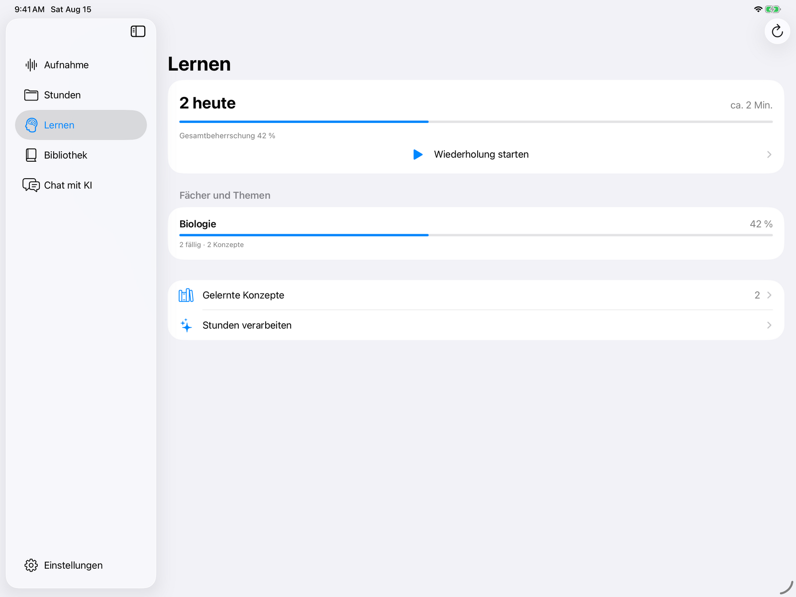

# What Echo does

Echo has six tabs: **Aufnahme**, **Stunden**, **Lernen**, **Bibliothek**,
**Chat** and **Einstellungen**, the last pinned to the foot of the sidebar.

## Live transcription

Audio is captured with AVAudioEngine, encoded as Opus, and streamed over a
WebSocket to the backend, which runs Qwen3-ASR on its own GPU. Recognised text
comes back while the teacher is still talking. Nothing is sent anywhere else
unless you press something that asks an AI a question.

The transcript fills the page as it arrives. Everything else — the sidebar, the
record control, the answer note — sits at the edges.

After class, a lesson's transcript menu can explicitly start a higher-quality
second pass from the local 48-kHz safety recording. The upload resumes after a
connection failure and never starts automatically. The live transcript stays
visible until the backend has completed the replacement; if it was manually
edited in the meantime, the new result is saved only as another restorable
version.

The same menu opens the timestamp-preserving transcript editor and a per-subject
vocabulary. Vocabulary can be maintained by hand or, on request, populated from
corrections, timetable names, earlier lessons and matching books in the Echo
library.

### Dead zones don't cost you the lesson

If the network drops mid-lesson, recording continues. Unsent audio is written to
a length-prefixed file on disk rather than held in memory, so an outage cannot
grow the app's RAM use however long it lasts. When the connection returns the
whole backlog is replayed at roughly eight times real time — fast enough to
catch up, slow enough that the server's transcriber never has to skip audio.

The one case where audio is dropped is a resume the server refuses: after an
outage long enough for its session grace to expire, the backlog belongs to a
sequence space that no longer exists, and the app reports how many buffered
packets it discarded.

## It knows your timetable

Connect WebUntis and recordings name themselves: subject, teacher, room. Record
straight through a double period and the recording is cut into one lesson per
period afterwards, so the archive matches the timetable rather than the tape.

The subject is a choice, not a verdict: the recording screen has a subject
picker seeded from the timetable, and a manual pick stays authoritative until
that recording ends. A lesson recorded in the wrong room, or during a
substitution the timetable never heard about, still lands in the right folder.

## The lesson archive

  

Stunden is a grid of folders, one per subject, each in its own colour with its
own icon. The folders come from WebUntis rather than from what happens to have
been recorded, so every subject you take has its place from the first launch and
an empty archive still looks like your own timetable. **Sonstige** collects
whatever was recorded while no lesson was running — the holidays, an evening, a
free period — and is the one folder the timetable cannot supply.

Open a folder and the subject's recordings are there, headed by the two figures
a subject adds up to — how long it has been recorded for in total, and how much
of that was this week. Every row leads with **what the lesson was about**: a
short AI-written topic, on one line and never two. Under it the subject, the
date and how long it ran, then the opening of the summary — so the list reads
for what was taught rather than for when. On a wide window the list is cut in
half and set in two columns, still read top to bottom, newest first. A long
press on a row deletes the lesson.

The topic comes from the server as its own field. When it is missing — an old
server, an old summary, a recording too short to summarise — the app falls back
in order: the first sentence of the summary, then the timetable title, then the
subject, and only if all of those are empty does a lesson show up under its
date. Nothing has to be renamed by hand.

A lesson is three cards: what it was about, the recording, and what was said.
The summary writes itself when the recording ends — the archive is a dozen
lessons of one subject at nearly the same time of day, and being told what each
one covered should not cost a button press per lesson. Transcript and audio both
stay on the server. The recording plays from its own waveform, so the silence
before the lesson started is visible rather than something you drag to find, and
tapping any line of the transcript plays from that moment while the page follows
along.

### Imported notes

Each archived lesson can also import notes authored elsewhere: native Goodnotes
documents, Notability `.note` files with an embedded PDF, PDFs, JPEGs and PNGs.
PDF export is the dependable interchange route for Notability. Echo decodes
searchable text, exact typed objects and Goodnotes' own handwriting index
locally on the iPad. For scans and missing handwriting data, Apple Vision's
accurate on-device text model is used as a conservative fallback. Visual page
coordinates determine reading order. When Goodnotes includes a page-content
timestamp inside the lesson, the imported page links to that point in the
recording. It is labelled as the page's last edit, not presented as an exact
timestamp for every Pencil stroke. Reimporting the same Goodnotes page updates it
through the document's stable internal IDs.

The original Goodnotes/Notability/PDF/image file and all rendered page images
remain on the iPad. Echo sends only the locally extracted text, stable page ID,
optional page timestamp and warnings to the user's own backend; new imports do
not create server-side note attachments.

Echo has no note editor or drawing canvas. Goodnotes and Notability remain the
place where notes are written; Echo only imports, reads and links them.

Echo also installs an iOS Share Extension. A page or document shared from
Goodnotes, Notability or Files is placed in Echo's App Group inbox. Open the
destination lesson, choose **Unterrichtsnotizen**, then tap the queued document
under **Aus dem Teilen-Menü**. The extension never guesses which lesson a file
belongs to and does not upload anything before that explicit choice.

## Lernen

A lesson that was recorded, transcribed and summarised is most of the way to
being revisable, so Echo takes the last step. **Lernen** turns lessons into
flashcards and schedules them.

  

Cards are generated per lesson, on request, from that lesson's transcript. They
come in several shapes — multiple choice, true/false, cloze, free text and oral
— and each keeps a link back to where it came from: the lesson, the concept, and
the millisecond offset in the transcript, so a card that is not obvious can be
traced to the moment it was taught.

The tab opens on what is due today, an estimate in minutes, and overall mastery,
with the same figures broken down per subject. A day's plan can be asked for by
the time available rather than by the card count — thirty minutes of revision
returns blocks per subject, each with a reason for being there.

Answers are checked by the server, not by self-assessment: a free-text answer
comes back categorised, with feedback and the expected answer. Every review
updates the card's box, stability, repetition and lapse counts, and its next due
date. Cards can be deleted individually when a generated one is not worth
keeping.

## Chat and the answer note

The chat answers free-form questions about the running recording or any past
lesson. While recording, a sticky note on the page answers "what did they just
say" for the last N seconds. A Home and Lock Screen widget does the same and is
deliberately anonymous-looking, which matters more than it should.

  

The context picker under the conversation decides what a question is answered
from: nothing, the running recording, or one particular lesson.

Questions can be typed, dictated or brought in from a file. Dictation uses
Apple's speech recognition directly and the captured audio never reaches Echo's
server. Attachments — PDFs, plain text, Markdown, CSV, HTML, JSON, and photos
taken with the camera or picked from the library — are read **on the iPad**:
text is extracted locally, images go through Apple Vision, and only the
resulting text is sent on. Attachments are capped at 12 MB and the extracted
text at 36 000 characters. A sent message can be edited and asked again.

## Einstellungen

Beyond the server address, port and token, the settings that matter during a
lesson:

- **App-Wechsel.** A three-finger tap leaves Echo for one chosen app — Goodnotes,
  Notability, or any URL scheme you type — and the recording keeps running. Notes
  are written where notes are written; the transcript does not stop for it.
- **Which AI answers.** The provider (ChatGPT or Gemini), the model, its
  reasoning effort and service tier are switched from inside the app and applied
  to the running server, so the choice survives without editing anything on the
  machine at home.
- **Audio.** Opus at 16, 24 or 32 kbit/s; 24 is the recommendation and costs
  about 11 MiB per hour. The record button's colour is yours to pick, and
  **Aufnahmediagnose** shows what the microphone and the connection are actually
  doing when a recording looks wrong.

## Bibliothek

The schoolbook shelf. PDFs sit in one folder on the server, appear in the app as
a grid of covers, and a book downloads once, into permanent storage, the first
time it is opened. After that it is available offline.

The reader shows a book rather than a document. One page, or a real 2–3 spread,
fills the screen; nothing scrolls; pages turn with a sideways flick. Zooming out
stops when the page reaches its natural size on the display, worked out for each
book from its own page dimensions and the current layout, so no book can shrink
into a stamp in the middle of the screen.

Schoolbooks rarely print page 1 on the first PDF page, so every book learns its
own numbering once: turn to any page whose number you can read, type that number,
and the rest of the book follows. It is remembered per book.

### Seite fragen

**Seite fragen** sits in the reader's control bar beside the page arrows and the
layout switch, only ever inside an open book. On an iPad it opens as an inspector
beside the page; on a phone it is a nonmodal sheet that can collapse while a
cited page is checked. The question goes to the server with the PDF page numbers
currently on screen — the server already has the book, so no page, picture or
text is uploaded. It reads that page there, looks at the rendered image when the
page is a diagram or scan, and may follow the book's own references into nearby
pages. The answer arrives with its book sources attached, named with the printed
numbers, and tapping one turns the reader without throwing the answer away.
Reading a downloaded book stays offline; asking about it needs the server.

Each page or spread has its own short thread. Turning the page switches context
instead of quietly attaching a follow-up to the previous page. The panel uses
the same conversation layout and composer as Chat: questions are free-form, can
be typed or dictated, and answers can be copied or generated again. There are no
preset task, explanation, summary or illustration actions. Sources stay collapsed
until wanted.

For something more precise than the current page, **Bereich markieren** closes
the panel and lets the student draw a rectangle directly on the PDF with a finger
or Apple Pencil. Echo sends only the page number and normalized rectangle
coordinates, not a screenshot. That marked region gets its own thread and remains
outlined while the answer is compared with the book.

A drawn rectangle is not final. The whole region can be dragged and every corner
has a handle — small to look at, generous to hit — so a selection that caught
half a diagram is corrected rather than redrawn.
